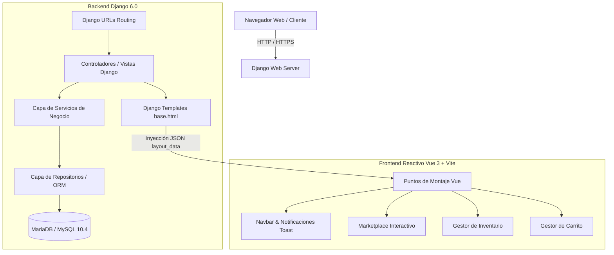
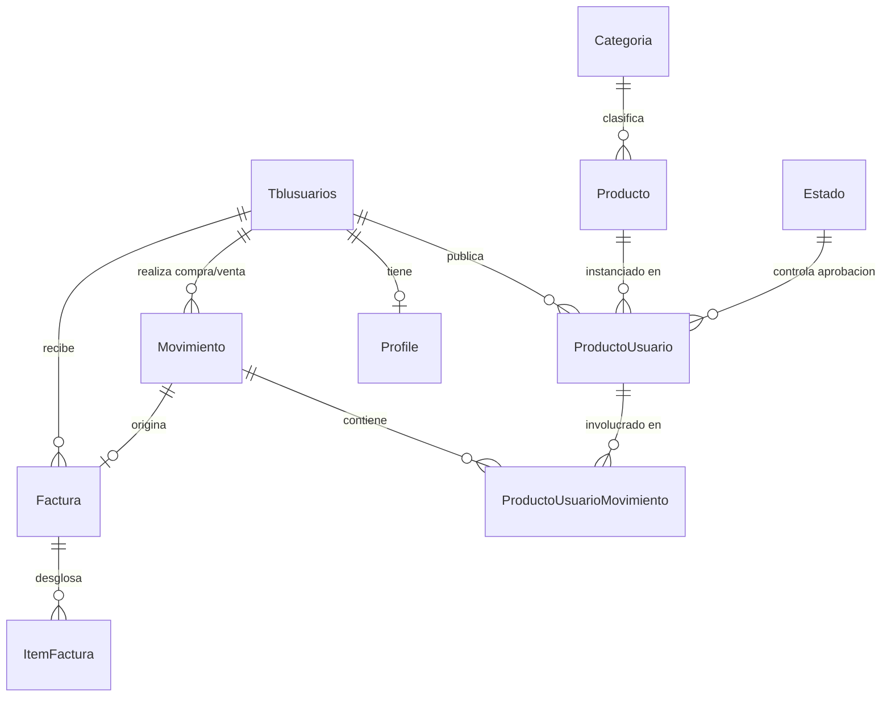

# Documentación Técnica y Funcional del Sistema AgroSFT

> **Versión del Sistema:** 2.1.0  
> **Fecha de Actualización:** Septiembre de 2026  
> **Ámbito:** Proyecto Formativo SENA — Centro de Gestión Agropecuaria / ADSO  
> **Metodología:** Specification-Driven Development (SDD)  
> **Idioma:** Español  

---

## Tabla de Contenido
1. [Resumen Ejecutivo y Visión General](#1-resumen-ejecutivo-y-visión-general)
2. [Arquitectura del Sistema y Stack Tecnológico](#2-arquitectura-del-sistema-y-stack-tecnológico)
3. [Base de Datos y Modelo Entidad-Relación](#3-base-de-datos-y-modelo-entidad-relación)
4. [Módulos Funcionales del Sistema](#4-módulos-funcionales-del-sistema)
   - [4.1 Módulo de Usuarios, Autenticación y Perfiles](#41-módulo-de-usuarios-autenticación-y-perfiles)
   - [4.2 Módulo de Inventario y Publicación de Cosechas](#42-módulo-de-inventario-y-publicación-de-cosechas)
   - [4.3 Módulo de Marketplace y Catálogo Público](#43-módulo-de-marketplace-y-catálogo-público)
   - [4.4 Módulo de Ventas, Solicitudes y Carrito](#44-módulo-de-ventas-solicitudes-y-carrito)
   - [4.5 Módulo de Facturación Electrónica y Comprobantes PDF](#45-módulo-de-facturación-electrónica-y-comprobantes-pdf)
   - [4.6 Módulo de Clientes](#46-módulo-de-clientes)
   - [4.7 Módulo de Administración, Moderación y Auditoría](#47-módulo-de-administración-moderación-y-auditoría)
5. [Capas de Seguridad (Defensa en Profundidad)](#5-capas-de-seguridad-defensa-en-profundidad)
6. [Arquitectura Frontend (Vue 3 + Vite + Django)](#6-arquitectura-frontend-vue-3--vite--django)
7. [Referencia de Rutas y Endpoints (URLs)](#7-referencia-de-rutas-y-endpoints-urls)
8. [Guía de Instalación, Configuración y Despliegue Local](#8-guía-de-instalación-configuración-y-despliegue-local)
9. [Convenciones de Código y Mantenimiento](#9-convenciones-de-código-y-mantenimiento)

---

## 1. Resumen Ejecutivo y Visión General

### 1.1 ¿Qué es AgroSFT?
**AgroSFT** es una plataforma web integral diseñada para transformar la cadena de suministro agropecuaria colombiana. Su objetivo central es conectar de manera directa y transparente a **pequeños y medianos productores campesinos** con **compradores mayoristas, comerciantes y consumidores finales**, reduciendo la excesiva intermediación comercial y garantizando precios justos para los trabajadores de la tierra.

### 1.2 Problemática que Resuelve
1. **Intermediación Desproporcionada:** Los campesinos suelen recibir un porcentaje mínimo del valor comercial de sus productos debido a múltiples capas de intermediarios.
2. **Pérdida de Cosechas por Falta de Mercado:** Falta de canales digitales accesibles para publicar la oferta disponible antes de que los productos perecederos se descompongan.
3. **Falta de Trazabilidad y Calidad:** Ausencia de historial comercial, calificaciones verificadas y comprobantes de compra/venta formales.
4. **Barreras Tecnológicas:** Interfaces excesivamente complejas no adaptadas al entorno rural.

### 1.3 Objetivos del Software
- Brindar a cada productor un **panel de inventario en tiempo real** donde gestionar sus cosechas, precios unitarios por unidad/kilo y existencias.
- Proporcionar un **Marketplace público reactivo** con filtros por categoría, búsqueda instantánea y carrito de compras.
- Respaldar las compras mediante **facturación formal** con desglose de impuestos (exención agrícola Ley 1607) y descarga de comprobantes en PDF.
- Registrar un **historial de auditoría inmutable** para garantizar la transparencia administrativa.

---

## 2. Arquitectura del Sistema y Stack Tecnológico

AgroSFT implementa una arquitectura híbrida desacoplada que combina la robustez y seguridad del backend en **Django** con la fluidez reactiva de **Vue 3** empaquetado mediante **Vite**.



### 2.1 Stack de Tecnologías

| Componente | Tecnología | Versión | Descripción / Propósito |
|---|---|---|---|
| **Lenguaje Backend** | Python | 3.10+ / 3.14 | Lenguaje principal del servidor. |
| **Framework Backend** | Django | 6.0.2 | Núcleo MVC/MVT, ORM, autenticación y seguridad. |
| **Base de Datos** | MariaDB / MySQL | 10.4+ | Motor de almacenamiento relacional con triggers activos. |
| **Framework Frontend** | Vue.js | 3.5+ | Componentes reactivos montados sobre vistas Django. |
| **Bundler Frontend** | Vite | 6.4+ | Compilación ultra-rápida de módulos JS y CSS. |
| **Diseño y Estilos** | Bootstrap 5 + Vanilla CSS | 5.1.3 | Sistema de rejilla y diseño visual personalizado. |
| **Iconografía** | Font Awesome | 6.4.0 | Iconografía vectorial corporativa. |
| **Motor de PDF** | xhtml2pdf / ReportLab | 0.2.16+ | Generación dinámica de facturas en formato PDF. |
| **OAuth Social** | social-auth-app-django | 5.4+ | Autenticación integrada con cuentas de Google. |
| **Manejo de Imágenes** | Pillow | 10.2.0 | Procesamiento, optimización y validación de fotografías de cosechas. |

---

## 3. Base de Datos y Modelo Entidad-Relación

La base de datos original fue diseñada con convenciones específicas (`tblusuarios`, `tblproductos`, etc.) bajo el esquema `managed = False` en los modelos de Django para preservar la integridad de triggers nativos y esquemas preexistentes, mientras que las tablas nuevas (`factura`, `item_factura`, `admin_audit_log`, `profile`) se integran fluidamente.

### 3.1 Diccionario de Tablas Principales



1. **`tblusuarios` (`apps.usuarios.models.Tblusuarios`):**
   - `id_users` (PK, int autoincremental).
   - `nombres`, `apellidos`, `correo` (Unique), `password` (hasheado).
   - `telefono`, `direccion`, `is_active`, `is_staff`, `is_superuser`.
2. **`tblproductos` (`apps.inventario.models.Producto`):**
   - `id_productos` (PK, int).
   - `nombre`, `descripcion`, `imagen`, `activo`.
   - `tblcategoria_id_categoria` (FK hacia `Categoria`).
3. **`tblcategoria` (`apps.inventario.models.Categoria`):**
   - `id_categoria` (PK, int).
   - `nombre`, `descripcion`, `activo`.
4. **`tblproductos_has_tblusuarios` (`apps.inventario.models.ProductoUsuario`):**
   - Vincula al campesino productor con un producto específico de la tabla maestra.
   - `id_pd_us` (PK).
   - `tblproductos_id_productos` (FK Producto), `tblusuarios_id_users` (FK Usuario).
   - `cantidad` (stock disponible), `precio` (precio unitario COP), `calificacion_promedio`.
   - `Estado_id_estado` (FK Estado: 1=Aprobado, 2=Pendiente, 3=Rechazado).
5. **`movimiento` (`apps.ventas.models.Movimiento`):**
   - `id_movimiento` (PK).
   - `id_usuario` (FK Tblusuarios comprador/vendedor), `id_tipo_movimiento` (FK: compra, venta, etc.).
   - `fecha_creacion`.
6. **`tblproductos_has_tblusuarios_has_movimiento` (`apps.ventas.models.ProductoUsuarioMovimiento`):**
   - Líneas de detalle de una transacción física o solicitud.
   - `id_movimiento`, `id_producto_usuario`, `cantidad`, `calificacion`.
7. **`factura` (`apps.facturacion.models.Factura`):**
   - `id_factura` (PK).
   - `id_usuario` (FK Tblusuarios cliente).
   - `id_movimiento` (FK Movimiento asociado).
   - `total` (Decimal), `metodo_pago_nombre`, `estado` ('emitida', 'cancelada'), `creada_en`, `pdf_generado`.
8. **`item_factura` (`apps.facturacion.models.ItemFactura`):**
   - `id_item` (PK), `id_factura` (FK Factura), `id_producto` (FK Producto).
   - `descripcion` (nombre limpio del producto), `cantidad`, `precio_unitario`, `subtotal`.

---

## 4. Módulos Funcionales del Sistema

### 4.1 Módulo de Usuarios, Autenticación y Perfiles
- **Autenticación Dual:** Soporta inicio de sesión mediante credenciales tradicionales (correo y contraseña protegida con Argon2/PBKDF2) e inicio de sesión social mediante **Google OAuth2** (`social-auth-app-django`).
- **Términos y Condiciones Legales:** Flujo de aceptación obligatoria de términos antes de interactuar en la plataforma, con registro del historial y fecha de aceptación.
- **Perfil de Usuario:** Administración de avatar, teléfono, ubicación rural/urbana y datos personales.

### 4.2 Módulo de Inventario y Publicación de Cosechas
- **Registro de Cosechas:** El campesino puede registrar sus lotes de producción especificando categoría, stock en kilogramos/unidades, precio unitario e imágenes reales del cultivo.
- **Flujo de Moderación:** Todo producto nuevo entra en estado **Pendiente** hasta que un moderador o administrador valida que la información cumple con las normas comunitarias, pasando a estado **Aprobado** para ser visible en el Marketplace.
- **Protección de Edición:** Validación estricta en controlador que impide que un usuario modifique o elimine inventario que pertenece a otro productor (Prevención de IDOR).

### 4.3 Módulo de Marketplace y Catálogo Público
- **Catálogo Interactivo en Vue 3:** Filtros reactivos instantáneos por categoría agrícola (Frutas, Hortalizas, Tubérculos, etc.) y búsqueda textual en tiempo real sin recargar la página.
- **Detalle de Producto:** Muestra procedencia del productor, stock disponible en tiempo real, valoraciones previas de otros compradores y botón de adición al carrito.

### 4.4 Módulo de Ventas, Solicitudes y Carrito
- **Carrito de Compras en Sesión:** Permite acumular productos de distintos productores, recalcular cantidades y subtotales en memoria de sesión antes de emitir la compra.
- **Venta Directa:** Canal ágil para que el productor registre transacciones presenciales en plaza o finca, deduciendo el stock de manera instantánea y generando el comprobante contable.
- **Solicitudes de Compra:** Flujo en el cual el comprador solicita un pedido y el campesino recibe una notificación en su buzón de pedidos para aceptar, preparar y despachar la mercancía.

### 4.5 Módulo de Facturación Electrónica y Comprobantes PDF
- **Generación Automática:** Cada orden confirmada genera automáticamente un registro contable inmutable (`Factura` y múltiples `ItemFactura`).
- **Nombres Limpios y Cantidades Enteras:** Limpieza de nombres de productos (evitando concatenaciones indeseadas de datos de compradores/vendedores) y formato numérico entero limpio (`1` en lugar de `1,00`).
- **Diseño Web Moderno:** Vista `detalle_factura.html` estructurada con cabecera verde institucional, insignias de estado, desglose fiscal (0% IVA Exento Agrícola) y acciones rápidas.
- **Generación de PDF Oficial:** Motor de generación mediante `xhtml2pdf` con maquetación ejecutiva, compatible con UTF-8, lista para imprimir o descargar como archivo físico (`Factura_FAC-00000X.pdf`).

### 4.6 Módulo de Clientes
- **Directorio de Clientes:** Vista para que el productor consulte la lista de clientes que le han comprado históricamente, permitiéndole fidelizar compradores mayoristas.

### 4.7 Módulo de Administración, Moderación y Auditoría
- **Moderación de Publicaciones:** Panel donde los administradores aprueban o rechazan productos agrícolas pendientes.
- **Auditoría Administrativa (`admin_audit_logs`):** Registro de cada acción crítica (aprobación de usuario, cambio de rol, suspensión, eliminación) con marca de tiempo, dirección IP del operador y descripción del cambio.

---

## 5. Capas de Seguridad (Defensa en Profundidad)

AgroSFT cuenta con una arquitectura de **9 capas de seguridad** que protegen la plataforma de punta a punta:

```
┌─────────────────────────────────────────────────────────────┐
│  1. Seguridad de Transporte y Red (HTTPS / HSTS)            │
├─────────────────────────────────────────────────────────────┤
│  2. Cabeceras HTTP Defensivas (Clickjacking, MIME Sniffing) │
├─────────────────────────────────────────────────────────────┤
│  3. Autenticación y Cuentas (Argon2, PBKDF2, OAuth2)        │
├─────────────────────────────────────────────────────────────┤
│  4. Control de Acceso y Autorización (RBAC + Anti-IDOR)     │
├─────────────────────────────────────────────────────────────┤
│  5. Integridad de Datos y Transaccionalidad (ACID)          │
├─────────────────────────────────────────────────────────────┤
│  6. Protección CSRF (Tokens sincronizados + AJAX Headers)   │
├─────────────────────────────────────────────────────────────┤
│  7. Protección XSS y Sanitización de Contenidos             │
├─────────────────────────────────────────────────────────────┤
│  8. Validación y Carga Segura de Archivos (Pillow + Exts)   │
├─────────────────────────────────────────────────────────────┤
│  9. Registro de Auditoría y Trazabilidad Forense            │
└─────────────────────────────────────────────────────────────┘
```

1. **Seguridad de Red y Transporte:** En entornos de producción se activan `SECURE_SSL_REDIRECT = True`, `SECURE_HSTS_SECONDS = 31536000`, cookies firmadas con atributos `Secure` y `HttpOnly`.
2. **Cabeceras HTTP de Seguridad:** `X-Frame-Options = 'DENY'` para mitigar ataques de Clickjacking; `SECURE_CONTENT_TYPE_NOSNIFF = True` para evitar ataques basados en confusión de tipo MIME.
3. **Autenticación Fuerte:** Validador de longitud mínima de contraseña (8+ caracteres), complejidad numérica y variación de caracteres; hashes PBKDF2 con sal individual de 260.000 iteraciones; control de usuarios inactivos.
4. **Autorización y Prevención de IDOR:** Cada endpoint sensible comprueba que el usuario autenticado sea el legítimo propietario del recurso (`id_usuario == request.user`). Roles diferenciados: Campesino/Productor, Comprador, Moderador y Superusuario.
5. **Transaccionalidad ACID:** Operaciones críticas (checkout, venta directa, descuento de existencias) se ejecutan bajo `@transaction.atomic`, evitando estados inconsistentes o pérdida de inventario por concurrencia.
6. **Protección CSRF:** Middleware nativo `CsrfViewMiddleware` activo en todas las peticiones POST/PUT. El frontend inyecta automáticamente la cookie `csrftoken` en el encabezado `X-CSRFToken` en llamadas asíncronas.
7. **Mitigación de XSS:** Renderizado seguro mediante auto-escape automático de plantillas Django y Vue 3.
8. **Seguridad en Carga de Archivos:** Validador de extensiones permitidas (`jpg`, `jpeg`, `png`, `webp`), validación estricta de tamaño máximo (5MB) e inspección real del buffer de imagen con Pillow.
9. **Trazabilidad y Auditoría:** Captura automática de IP de origen y registro en base de datos de cada acción ejecutada en el panel de control.

---

## 6. Arquitectura Frontend (Vue 3 + Vite + Django)

### 6.1 Integración Híbrida
El frontend no es una SPA monolítica separada, sino una arquitectura híbrida de alto rendimiento:
1. **Django** procesa la petición HTTP, verifica permisos y renderiza la plantilla base HTML.
2. La vista Django inyecta variables y configuraciones en el DOM mediante etiquetas seguras:
   ```html
   {{ layout_data|json_script:"layout-data" }}
   ```
3. El script empaquetado por Vite `static/dist/layout.js` se monta de forma reactiva en el elemento `#vue-navbar`, cargando el menú, el estado del usuario, el contador del carrito y el sistema de toasts.

### 6.2 Sistema de Notificaciones Flotantes (Toast Premium)
El sistema de notificaciones está integrado en `NavbarApp.vue` y `style.css`:
- **Glassmorphism:** Fondo blanco translúcido con desenfoque de fondo (`backdrop-filter: blur(16px)`).
- **Indicador Circular:** Ícono personalizado con paleta diferenciada (Verde para éxito, Rojo para errores, Ámbar para advertencias, Azul para información).
- **Temporizador Visual:** Barra de progreso inferior en degradé que muestra la cuenta regresiva antes de que la alerta se cierre automáticamente.
- **Cierre Manual:** Botón discreto que descarta el toast al instante.

---

## 7. Referencia de Rutas y Endpoints (URLs)

### Módulo: Usuarios (`apps.usuarios`) — Prefijo: `/usuarios/`
| Método | Ruta URL | Controlador / Vista | Descripción |
|---|---|---|---|
| GET/POST | `/usuarios/login/` | `UserLoginView` | Inicio de sesión tradicional. |
| POST | `/usuarios/logout/` | `UserLogoutView` | Cierre de sesión seguro. |
| GET/POST | `/usuarios/registro/` | `UserRegisterView` | Registro de nuevos usuarios. |
| GET/POST | `/usuarios/perfil/` | `perfil_usuario` | Consulta y edición del perfil. |
| GET/POST | `/usuarios/cambiar-password/` | `UserPasswordChangeView` | Cambio de contraseña para usuarios autenticados. |
| GET | `/usuarios/terminos/` | `TerminosView` | Lectura de términos y condiciones. |
| POST | `/usuarios/terminos/aceptar/` | `AceptarTerminosView` | Aceptación de términos legales. |
| GET | `/usuarios/admin/usuarios/` | `admin_usuarios_list` | Gestión administrativa de usuarios (Staff). |
| GET | `/usuarios/admin/moderacion/` | `admin_moderacion_list`| Panel de moderación de productos (Staff). |
| GET | `/usuarios/admin/logs/` | `admin_audit_logs` | Consulta de registros de auditoría (Staff). |

### Módulo: Inventario (`apps.inventario`) — Prefijo: `/inventario/`
| Método | Ruta URL | Controlador / Vista | Descripción |
|---|---|---|---|
| GET | `/inventario/` | `producto_list` | Inventario personal del campesino. |
| GET/POST | `/inventario/crear/` | `producto_create` | Formulario de registro de nuevo producto. |
| GET/POST | `/inventario/editar/<id>/` | `producto_edit` | Edición de producto existente. |
| POST | `/inventario/eliminar/<id>/` | `producto_delete` | Eliminación de producto del inventario. |
| GET | `/inventario/marketplace/` | `marketplace_view` | Marketplace público de productos agrícolas. |
| GET | `/inventario/producto/<id>/` | `producto_detail` | Ficha técnica y detalle del producto. |

### Módulo: Ventas y Carrito (`apps.ventas`) — Prefijo: `/ventas/`
| Método | Ruta URL | Controlador / Vista | Descripción |
|---|---|---|---|
| GET | `/ventas/carrito/` | `carrito_detalle` | Vista del carrito de compras. |
| POST | `/ventas/carrito/agregar/<id>/`| `carrito_agregar` | Agregar ítem al carrito de compras. |
| POST | `/ventas/carrito/actualizar/<id>/`| `carrito_actualizar` | Cambiar cantidad de un producto en el carrito. |
| POST | `/ventas/carrito/eliminar/<id>/`| `carrito_eliminar` | Eliminar ítem del carrito. |
| GET/POST | `/ventas/carrito/checkout/` | `checkout` | Generar solicitud formal de compra. |
| GET/POST | `/ventas/carrito/checkout-venta/`| `checkout_venta_directa`| Concretar venta directa y descontar stock. |
| GET | `/ventas/solicitudes/` | `solicitudes_list` | Bandeja de solicitudes de compra recibidas. |
| GET | `/ventas/lista/` | `venta_list` | Listado de ventas cerradas del productor. |
| GET | `/ventas/mis-compras/` | `compra_list` | Listado de compras realizadas por el usuario. |

### Módulo: Facturación (`apps.facturacion`) — Prefijo: `/facturacion/`
| Método | Ruta URL | Controlador / Vista | Descripción |
|---|---|---|---|
| GET | `/facturacion/detalle/<id>/` | `detalle_factura` | Vista web moderna del comprobante de venta. |
| GET | `/facturacion/historial/` | `historial_facturas` | Historial de facturas emitidas para el usuario. |
| GET | `/facturacion/pdf/<id>/` | `generar_pdf_factura` | Generación y descarga del comprobante PDF oficial. |
| GET | `/facturacion/generar_pedido/<mov_id>/` | `generar_factura_pedido` | Genera o recupera factura desde un movimiento. |

---

## 8. Guía de Instalación, Configuración y Despliegue Local

### 8.1 Requisitos del Sistema
- **Python:** 3.10 o superior (verificado con Python 3.14).
- **Node.js:** 18.0 o superior con `npm`.
- **Servidor de Base de Datos:** MariaDB 10.4+ o MySQL 8.0+.
- **Git:** Para control de versiones.

### 8.2 Clonación y Entorno Virtual
```bash
# 1. Clonar el repositorio
git clone https://github.com/danieldavid-23/agrosft.git
cd agrosft

# 2. Crear entorno virtual en Windows (PowerShell)
python -m venv env
.\env\Scripts\activate

# 2. En Linux / MacOS
python3 -m venv env
source env/bin/activate
```

### 8.3 Instalación de Dependencias
```bash
# Dependencias de Python
pip install -r requirements.txt

# Dependencias del Frontend (Vite + Vue 3)
npm install
```

### 8.4 Configuración de Variables de Entorno (`.env`)
Crear un archivo `.env` en la raíz del proyecto con la siguiente configuración base:
```ini
DEBUG=True
SECRET_KEY=clave_secreta_de_desarrollo_agrosft_2026

# Conexión a Base de Datos
DB_NAME=agrosft
DB_USER=root
DB_PASSWORD=tu_contraseña
DB_HOST=127.0.0.1
DB_PORT=3306

# Google OAuth2 (Opcional en desarrollo)
GOOGLE_CLIENT_ID=
GOOGLE_CLIENT_SECRET=
```

### 8.5 Compilación de Activos Frontend
```bash
# Compilar los bundles de Vue y estilos CSS
npm run build

# O en modo desarrollo con observador en caliente:
npm run dev
```

### 8.6 Migraciones y Superusuario
```bash
# Aplicar migraciones
python manage.py migrate

# Crear el superadministrador inicial
python manage.py createsuperuser
```

### 8.7 Iniciar el Servidor de Desarrollo
```bash
python manage.py runserver
```
La aplicación quedará disponible en: `http://127.0.0.1:8000/`

---

## 9. Convenciones de Código y Mantenimiento

1. **Modelo Thin Controller, Fat Service:** Los controladores (`controllers/`) se limitan a recibir la petición HTTP, verificar permisos y delegar la lógica contable y de negocio a los servicios (`services/`).
2. **Gestión de Moneda:** En Colombia, el peso (COP) no maneja centavos comúnmente en ventas de mostrador. Utilizar el filtro `|currency_cop` de `core/templatetags/currency_tags.py` para que números enteros no muestren `.00` y utilicen punto como separador de miles (ej. `$40.000`).
3. **Formato de Cantidades:** Usar `|format_cantidad` para que ítems enteros de inventario muestren `1` en lugar de `1,00`.
4. **Nombres Limpios de Producto:** Emplear `item.nombre_producto_limpio` para garantizar que la descripción no mezcle nombres de usuarios en reportes y facturas.
5. **Compilación de Estilos:** Cualquier modificación en `frontend/src/style.css` o en componentes Vue requiere ejecutar `npm run build` para actualizar `static/dist/`.
