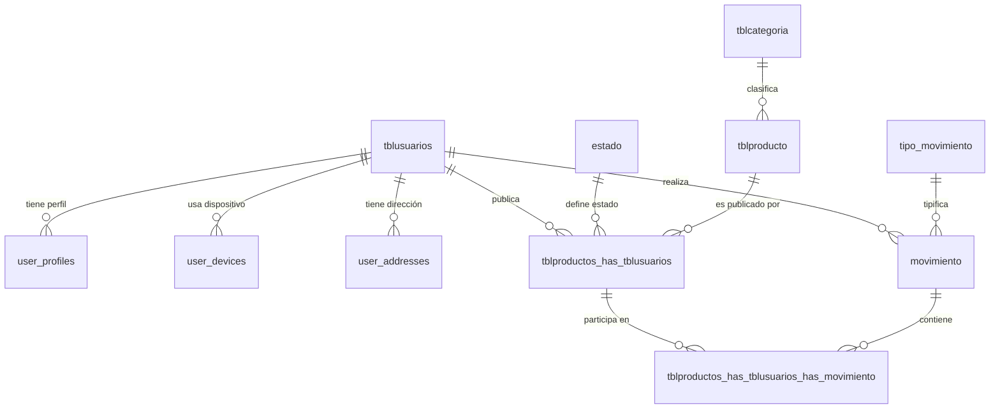

# DATABASE.md — AgroSFT

> Modelo de datos completo: entidades, relaciones y triggers.  
> **Motor**: MariaDB 10.4 | **Gestión**: Externa (Django NO modifica schema)

---

## 1. Diagrama Entidad-Relación

---

## 2. Tablas Detalladas

### 2.1 tblusuarios — Usuarios del Sistema

| Columna | Tipo | Nullable | Default | Descripción |
|---|---|---|---|---|
| `id_users` | INT (PK, AUTO_INCREMENT) | No | — | Identificador único |
| `nombres` | VARCHAR(45) | No | — | Nombres del usuario |
| `apellidos` | VARCHAR(45) | No | — | Apellidos del usuario |
| `Telefono` | VARCHAR(45) | Yes | NULL | Teléfono de contacto |
| `correo` | VARCHAR(45) UNIQUE | No | — | Email (USERNAME_FIELD) |
| `contraseña` | VARCHAR(255) | No | — | Hash de contraseña (Django) |
| `fecha_creacion` | DATETIME | No | CURRENT_TIMESTAMP | Fecha de registro |
| `last_login` | DATETIME | Yes | NULL | Último acceso |
| `is_superuser` | BOOLEAN | No | FALSE | Es superusuario |
| `is_staff` | BOOLEAN | No | FALSE | Es administrador |
| `is_active` | BOOLEAN | No | TRUE | Cuenta activa |

**Modelo Django**: `apps.usuarios.models.profile_model.Tblusuarios`  
**Rol**: AUTH_USER_MODEL del sistema

---

### 2.2 user_profiles — Perfiles Extendidos

| Columna | Tipo | Nullable | Default | Descripción |
|---|---|---|---|---|
| `id_perfil` | INT (PK, AUTO_INCREMENT) | No | — | Identificador único |
| `id_usuario` | INT | No | — | FK lógica a tblusuarios |
| `imagen_perfil` | VARCHAR (path) | Yes | NULL | Ruta de imagen |
| `biografia` | TEXT | Yes | NULL | Biografía del usuario |
| `sitio_web` | VARCHAR | Yes | NULL | URL personal |
| `telefono_contacto` | VARCHAR(20) | Yes | NULL | Teléfono alternativo |
| `direccion_envio_predeterminada` | TEXT | Yes | NULL | Dirección principal |
| `fecha_creacion` | DATETIME | No | CURRENT_TIMESTAMP | Fecha de creación |
| `fecha_actualizacion` | DATETIME | No | CURRENT_TIMESTAMP | Última actualización |
| `notificaciones_activas` | BOOLEAN | No | TRUE | Recibir notificaciones |
| `idioma_preferido` | VARCHAR(10) | No | 'es' | Idioma preferido |
| `zona_horaria` | VARCHAR(50) | No | 'America/Bogota' | Zona horaria |

**Modelo Django**: `apps.usuarios.models.profile_model.UserProfile`

---

### 2.3 tblcategoria — Categorías de Productos

| Columna | Tipo | Nullable | Default | Descripción |
|---|---|---|---|---|
| `idt_categoria` | INT (PK, AUTO_INCREMENT) | No | — | Identificador único |
| `categoria` | VARCHAR(45) | No | — | Nombre de la categoría |
| `descripcion` | TEXT | Yes | NULL | Descripción |
| `activo` | BOOLEAN | No | TRUE | Categoría activa |
| `created_at` | DATETIME | Yes | NULL | Fecha de creación |
| `updated_at` | DATETIME | Yes | NULL | Última actualización |

**Modelo Django**: `apps.inventario.models.producto.Categoria`  
**Valores típicos**: Frutas, Verduras, Tubérculos, Granos y Cereales, Insumos Agrícolas

---

### 2.4 tblproducto — Catálogo Maestro de Productos

| Columna | Tipo | Nullable | Default | Descripción |
|---|---|---|---|---|
| `id_productos` | INT (PK, AUTO_INCREMENT) | No | — | Identificador único |
| `nombre` | VARCHAR(45) | No | — | Nombre del producto |
| `descripcion` | TEXT | Yes | NULL | Descripción detallada |
| `cantidad` | INT | No | 0 | Stock global de referencia |
| `fecha_creacion` | DATETIME | No | CURRENT_TIMESTAMP | Fecha de creación |
| `tblcategoria_idt_categoria` | INT (FK) | No | — | FK a tblcategoria |
| `stock_minimo` | INT | No | 5 | Umbral de alerta de stock |
| `estado` | VARCHAR(20) | No | 'pendiente' | Estado del producto |
| `eliminado` | BOOLEAN | No | FALSE | Soft delete flag |
| `fecha_eliminacion` | DATETIME | Yes | NULL | Fecha de eliminación |
| `eliminado_por_id` | INT | Yes | NULL | Usuario que eliminó |
| `updated_at` | DATETIME | Yes | NULL | Última actualización |

**Modelo Django**: `apps.inventario.models.producto.Producto`

---

### 2.5 estado — Estados de Publicación

| Columna | Tipo | Nullable | Default | Descripción |
|---|---|---|---|---|
| `id_estado` | INT (PK, AUTO_INCREMENT) | No | — | Identificador único |
| `estado` | VARCHAR(45) | No | — | Nombre del estado |

**Valores**: `Pendiente`, `Aprobado`, `Rechazado`  
**Modelo Django**: `apps.inventario.models.producto.Estado`

---

### 2.6 tblproductos_has_tblusuarios — Publicaciones por Vendedor

| Columna | Tipo | Nullable | Default | Descripción |
|---|---|---|---|---|
| `id_pd_us` | INT (PK, AUTO_INCREMENT) | No | — | Identificador único |
| `tblproductos_id_productos` | INT (FK) | No | — | FK a tblproducto |
| `tblusuarios_id_users` | INT (FK) | No | — | FK a tblusuarios |
| `Estado_id_estado` | INT (FK) | No | — | FK a estado |
| `cantidad` | DECIMAL(10,2) | No | 0.00 | Stock disponible (actualizado por trigger) |
| `fecha_creacion` | DATETIME | No | CURRENT_TIMESTAMP | Fecha de publicación |
| `precio` | DECIMAL(10,2) | No | 0.00 | Precio unitario |
| `calificacion_promedio` | DECIMAL(3,1) | Yes | NULL | Promedio de calificaciones (trigger) |

**Modelo Django**: `apps.inventario.models.producto.ProductoUsuario`

> [!warning] Campos gestionados por triggers
> `cantidad` y `calificacion_promedio` son actualizados automáticamente por `trg_actualizar_stock_oferta`.

---

### 2.7 tipo_movimiento — Tipos de Movimiento

| Columna | Tipo | Nullable | Default | Descripción |
|---|---|---|---|---|
| `id_tipo_movimiento` | INT (PK, AUTO_INCREMENT) | No | — | Identificador único |
| `tipo_movimiento` | VARCHAR(45) | No | — | Nombre del tipo |

**Valores**: `compra`, `venta`, `rechazada`, `vendida`  
**Modelo Django**: `apps.ventas.models.movimiento.TipoMovimiento`

---

### 2.8 movimiento — Header de Transacciones

| Columna | Tipo | Nullable | Default | Descripción |
|---|---|---|---|---|
| `id_movimiento` | INT (PK, AUTO_INCREMENT) | No | — | Identificador único |
| `tipo_movimiento_id_tipo_movimiento` | INT (FK) | No | — | FK a tipo_movimiento |
| `tblusuarios_id_users` | INT (FK) | No | — | FK a tblusuarios (comprador) |

**Modelo Django**: `apps.ventas.models.movimiento.Movimiento`

> [!note] Sin campos de fecha ni descripción
> La fecha del movimiento se almacena en la tabla de detalles (`tblproductos_has_tblusuarios_has_movimiento.fecha_movimiento`).

---

### 2.9 tblproductos_has_tblusuarios_has_movimiento — Detalles de Movimiento

| Columna | Tipo | Nullable | Default | Descripción |
|---|---|---|---|---|
| `id_movimiento_usuario` | INT (PK, AUTO_INCREMENT) | No | — | Identificador único |
| `tblproductos_has_tblusuarios_id_pd_us` | INT (FK) | No | — | FK a ProductoUsuario |
| `movimiento_id_movimiento` | INT (FK) | No | — | FK a movimiento |
| `cantidad` | DECIMAL(10,2) | No | 0.00 | Cantidad (negativa=salida, positiva=entrada) |
| `calificacion` | DECIMAL(3,1) | Yes | NULL | Calificación 1.0-5.0 |
| `fecha_movimiento` | DATETIME | No | CURRENT_TIMESTAMP | Fecha de la transacción |

**Modelo Django**: `apps.ventas.models.movimiento.ProductoUsuarioMovimiento`

> [!danger] Convención de signos
> - **Positiva**: Abastecimiento/entrada de stock
> - **Negativa**: Venta/salida de stock

---

### 2.10 user_devices — Dispositivos de Usuario

| Columna | Tipo | Nullable | Default | Descripción |
|---|---|---|---|---|
| `id_dispositivo` | INT (PK, AUTO_INCREMENT) | No | — | Identificador único |
| `id_usuario` | INT (FK) | No | — | FK a tblusuarios |
| `dispositivo_id` | VARCHAR(255) | No | — | ID del dispositivo |
| `tipo_dispositivo` | VARCHAR(50) | No | — | desktop/mobile/tablet |
| `sistema_operativo` | VARCHAR(100) | No | — | OS del dispositivo |
| `navegador` | VARCHAR(100) | No | — | Browser utilizado |
| `ultima_conexion` | DATETIME | No | CURRENT_TIMESTAMP | Última actividad |
| `fecha_registro` | DATETIME | No | CURRENT_TIMESTAMP | Fecha de registro |
| `esta_activo` | BOOLEAN | No | TRUE | Dispositivo activo |

**Modelo Django**: `apps.usuarios.models.profile_model.UserDevice`

---

### 2.11 user_addresses — Direcciones de Usuario

| Columna | Tipo | Nullable | Default | Descripción |
|---|---|---|---|---|
| `id_direccion` | INT (PK, AUTO_INCREMENT) | No | — | Identificador único |
| `id_usuario` | INT (FK) | No | — | FK a tblusuarios |
| `direccion` | VARCHAR(255) | No | — | Dirección física |
| `ciudad` | VARCHAR(100) | No | — | Ciudad |
| `departamento` | VARCHAR(100) | No | — | Departamento/Estado |
| `codigo_postal` | VARCHAR(20) | No | — | Código postal |
| `pais` | VARCHAR(100) | No | — | País |
| `es_principal` | BOOLEAN | No | FALSE | Dirección principal |
| `fecha_creacion` | DATETIME | No | CURRENT_TIMESTAMP | Fecha de creación |
| `fecha_actualizacion` | DATETIME | No | CURRENT_TIMESTAMP | Última actualización |

**Modelo Django**: `apps.usuarios.models.profile_model.UserAddress`

---

## 3. Triggers de Base de Datos

### trg_actualizar_stock_oferta (MODIFICADO)

**Evento**: AFTER INSERT ON `tblproductos_has_tblusuarios_has_movimiento`

**Acciones**:
1. Si el movimiento **NO** es tipo `'compra'`: actualiza `cantidad` en `tblproductos_has_tblusuarios` sumando la cantidad del movimiento
2. **Protección**: Si la cantidad es negativa (salida), valida que el stock no quede < 0. Emite `SIGNAL SQLSTATE '45000'` si es insuficiente
3. Si el movimiento incluye calificación, recalcula `calificacion_promedio`

> [!warning] Comportamiento modificado (2026-06-17)
> Anteriormente actualizaba stock en CUALQUIER inserción. Ahora **omite** la actualización de stock cuando el tipo_movimiento es `'compra'` (solicitud de compra pendiente).
> Las solicitudes de compra ya no descuentan stock hasta que la venta se confirme como `'vendida'`.
> Incluye protección contra stock negativo con `SIGNAL` error.
> **Scripts**: `scripts/trigger_modificar_stock.sql` (básico) o `scripts/trigger_proteccion_stock.sql` (con protección)

---

### trg_descontar_stock_vendida (NUEVO)

**Evento**: AFTER UPDATE ON `movimiento`

**Acciones**:
1. Detecta cuando `tipo_movimiento` cambia a `'vendida'` desde otro estado
2. Descuenta `ABS(cantidad)` del stock de cada `ProductoUsuario` afectado via JOIN con `tblproductos_has_tblusuarios_has_movimiento`

> [!important] Flujo de stock actualizado
> | Paso | Tipo movimiento | Efecto en stock |
> |---|---|---|
> | Checkout (comprador) | `'compra'` | Sin cambio (trigger ignora) |
> | Aceptar (vendedor) | `'venta'` | Sin cambio (es UPDATE, no INSERT) |
> | Marcar vendido (vendedor) | `'vendida'` | **Descuenta stock** |
>
> **Script**: `scripts/trigger_stock_vendida.sql`

> [!danger] Regla Crítica
> Los triggers son la ÚNICA fuente de verdad para stock y calificación promedio.
> **NUNCA** actualizar estos campos manualmente desde Python.

---

## 4. Tablas Obsoletas (No Usar)

| Modelo | Tabla (inexistente) | Razón |
|---|---|---|
| `SolicitudCompra` | `ventas_solicitudcompra` | Reemplazado por `Movimiento` con tipo='compra' |
| `DetalleSolicitudCompra` | `ventas_detallesolicitudcompra` | Reemplazado por `ProductoUsuarioMovimiento` |
| `Venta` | `ventas_venta` | Reemplazado por `Movimiento` con tipo='venta' |
| `DetalleVenta` | `ventas_detalleventa` | Reemplazado por `ProductoUsuarioMovimiento` |

> Ver [[ARCHITECTURE#2.4 apps.ventas — Transacciones]] para la arquitectura actual.

---

## 5. Modelo No Usado

| Modelo | Tabla | Problema |
|---|---|---|
| `Cliente` | `clientes` | No tiene `managed = False`, no se usa en el código |

---

## Enlaces Relacionados

- [[PROJECT_CONTEXT]] — Contexto global del proyecto
- [[ARCHITECTURE]] — Cómo los modelos se integran en la arquitectura
- [[API]] — Endpoints que leen/escriben en estas tablas
- [[REQUIREMENTS]] — Requisitos que justifican cada tabla
