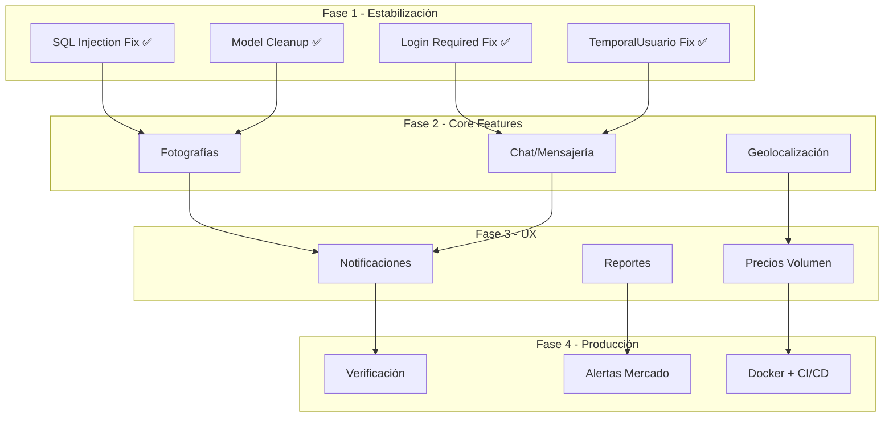

# ROADMAP.md — AgroSFT

> Planificación y evolución futura del sistema.  
> Basado en brechas identificadas entre la implementación actual y la ficha SENA.

---

## Estado Actual

| Módulo | Cobertura | Funcionalidades |
|---|---|---|
| Usuarios | 85% | Auth, perfil, términos, recuperación, panel admin, OAuth (config) |
| Inventario | 90% | CRUD, marketplace, aprobación, filtros, fotos/galería |
| Ventas | 80% | Carrito, solicitudes, ventas, compras, calificaciones |
| Facturación | 80% | Facturas, historial, PDF (xhtml2pdf) |
| Clientes | 70% | Listado, historial básico |
| **Brechas críticas** | 50% | Fotos ✅ · Facturación ✅ · Chat, geolocalización, notificaciones pendientes |

---

## Fases de Evolución

### Fase 1: Estabilización y Seguridad (Completada)

**Objetivo**: Corregir problemas técnicos y asegurar la base.

| Tarea | Prioridad | Complejidad | Estado |
|---|---|---|---|
| Corregir SQL injection en `tabla_existe()` y `columna_existe()` | Crítica | Baja | ✅ Completa (2026-09-07, queries parametrizadas vía information_schema) |
| Agregar `@login_required` a vistas de carrito | Alta | Baja | ✅ Completa (2026-09-07) |
| Eliminar clase `TemporalUsuario` (check_password always True) | Alta | Baja | ✅ Completa (2026-09-07, eliminada) |
| Consolidar modelo duplicado `TipoMovimiento` | Media | Media | ✅ Completa (2026-09-07, canónico en `ventas.models.movimiento`) |
| Eliminar modelos obsoletos (`SolicitudCompra`, `Venta`) | Media | Baja | ✅ Completa (2026-09-07, eliminados `solicitud.py` y `venta.py` + forms) |
| Completar password reset (backend real con email) | Media | Media | ✅ Completa (2026-06-30, Brevo) |
| Agregar `managed = False` a modelo `Cliente` | Media | Baja | ✅ Completa (2026-09-07) |

---

### Fase 2: Funcionalidades Core Faltantes

**Objetivo**: Implementar las funcionalidades críticas de la ficha SENA.

#### 2.1 Fotografías de Productos (GAP-02) — ✅ Implementado (2026-08-20)

| Aspecto | Detalle |
|---|---|
| **Prioridad** | Alta |
| **Complejidad** | Media |
| **Impacto** | Mejora la experiencia de compra significativamente |

**Estado**: Implementado (2026-08-20) y ampliado con **galería/carrusel de múltiples imágenes** (2026-09-04, ver [[DECISIONS#ADR-014]]). Redimensionado automático con **Pillow a máx. 400×400 px** (thumbnails que preservan la relación de aspecto, PNG paleta/JPEG q72/WebP) implementado en 2026-09-07 en `Producto`, `ProductoImagen` y `UserProfile` vía `ResizableImageField` (redimensiona antes de persistir, ver [[DECISIONS#ADR-013]]); comando `manage.py redimensionar_imagenes` para reprocesar imágenes ya almacenadas y cache-busting `?v=` en las URLs. Campo `imagen` en `tblproducto` (VARCHAR(255) NULL) como portada + tabla `tblproducto_imagenes` para imágenes adicionales, `ResizableImageField` en el modelo `Producto`/`ProductoImagen`, upload a `MEDIA_ROOT/productos/`, validación de extensión (JPG/JPEG/PNG/WEBP) y tamaño (máx. 5MB) en modelo y formularios. Ver [[REQUIREMENTS#RF-I15]], [[REQUIREMENTS#RF-I16]], [[USER_STORIES#US-15]], [[USER_STORIES#US-16]] y [[DECISIONS#ADR-013]].

**Especificación original (referencia)**:
- Agregar campo `imagen` en `ProductoUsuario` o nueva tabla `producto_imagen` *(decisión final: columna `imagen` en `tblproducto`, catálogo maestro + tabla `tblproducto_imagenes`)*
- Upload con Pillow para compresión automática *(✅ implementado (2026-09-07): thumbnails a máx. 400×400 px con Pillow vía `ResizableImageField` + backfill `manage.py redimensionar_imagenes`)*
- Galería de hasta 5 imágenes por producto *(✅ implementado: carrusel en tarjetas y detalle, sin tope fijo de archivos)*
- Thumbnail en cards del marketplace *(implementado)*
- Vista ampliada en detalle de producto *(implementado)*

#### 2.2 Chat/Mensajería (GAP-01)

| Aspecto | Detalle |
|---|---|
| **Prioridad** | Alta |
| **Complejidad** | Alta |
| **Impacto** | Comunicación directa comprador-vendedor |

**Especificación**:
- Nuevo módulo `apps.mensajeria`
- Tabla `mensaje`: emisor, receptor, contenido, timestamp, leído
- WebSockets con Django Channels (o polling AJAX como alternativa)
- Componente Vue `ChatApp.vue`
- Notificación de nuevos mensajes

#### 2.3 Geolocalización (GAP-03)

| Aspecto | Detalle |
|---|---|
| **Prioridad** | Media |
| **Complejidad** | Media |
| **Impacto** | Permite buscar productos por ubicación |

**Especificación**:
- Campos latitud/longitud en `UserProfile` o `tblproducto`
- Mapa interactivo con Leaflet.js
- Filtro de radio de búsqueda
- Visualización de agricultores en mapa

#### 2.4 Documentos Comerciales / Facturación — ✅ Implementado (2026-09-07)

| Aspecto | Detalle |
|---|---|
| **Prioridad** | Media |
| **Complejidad** | Media |
| **Impacto** | Soporte documental de las transacciones |

**Estado**: Implementado (2026-09-07). Nueva app `apps.facturacion` con tablas propias gestionadas por migraciones Django (`factura` e `item_factura`). Generación de PDF de facturas con **xhtml2pdf**; historial de facturas por usuario; creación de factura desde carrito y generación de PDF desde un movimiento (pedido). Ver [[ARCHITECTURE#2.6]], [[DATABASE#2.12]], [[DATABASE#2.13]], [[API#5]] y [[DECISIONS#ADR-016]].

**Especificación**:
- Tablas `factura` (cabecera) e `item_factura` (líneas) vía migraciones Django ✅
- Historial de facturas del usuario ✅
- PDF descargable (`?descargar=1`) e inline ✅
- Factura desde movimiento/pedido ✅
- Numeración consecutiva por vendedor y totales calculados ✅

---

### Fase 3: Mejoras de Experiencia

#### 3.1 Notificaciones Push (GAP-04)

| Aspecto | Detalle |
|---|---|
| **Prioridad** | Media |
| **Complejidad** | Alta |
| **Impacto** | Alertas en tiempo real para solicitudes |

**Especificación**:
- Sistema de notificaciones in-app
- Web Push con Service Workers
- Email notifications para eventos clave

#### 3.2 Precios por Volumen (GAP-05)

| Aspecto | Detalle |
|---|---|
| **Prioridad** | Media |
| **Complejidad** | Media |
| **Impacto** | Incentiva compras mayores |

**Especificación**:
- Tabla `precio_volumen`: producto_usuario, cantidad_min, precio_descuento
- UI para configurar rangos de precio
- Cálculo automático en carrito

#### 3.3 Reportes y Estadísticas (GAP-08)

| Aspecto | Detalle |
|---|---|
| **Prioridad** | Baja |
| **Complejidad** | Media |
| **Impacto** | Visibilidad del negocio para agricultores |

**Especificación**:
- Dashboard con gráficas (Chart.js)
- Ventas por período, productos más vendidos
- Exportar a PDF/Excel

---

### Fase 4: Escalamiento y Producción

#### 4.1 Verificación de Agricultores (GAP-06)

- Proceso de verificación de identidad
- Badge de "Agricultor Verificado"
- Documentos de soporte

#### 4.2 Alertas de Mercado (GAP-07)

- Monitoreo de precios del mercado
- Alertas de variación de precios
- Tendencias de disponibilidad

#### 4.3 Preparación para Producción

| Tarea | Descripción |
|---|---|
| Migrar a PostgreSQL/MySQL 8 | Mejor soporte que MariaDB 10.4 |
| Redis como cache backend | Reemplazar LocMemCache |
| Gunicorn + Nginx | Servidor de producción |
| Docker containerization | Despliegue consistente |
| CI/CD pipeline | Testing automático |
| Test suite completo | Cobertura de código |

---

## Priorización Visual

---

## Enlaces Relacionados

- [[PROJECT_CONTEXT]] — Contexto global del proyecto
- [[REQUIREMENTS]] — Requisitos implementados y pendientes
- [[DECISIONS]] — Decisiones técnicas registradas
- [[CHANGELOG]] — Historial de cambios realizados
